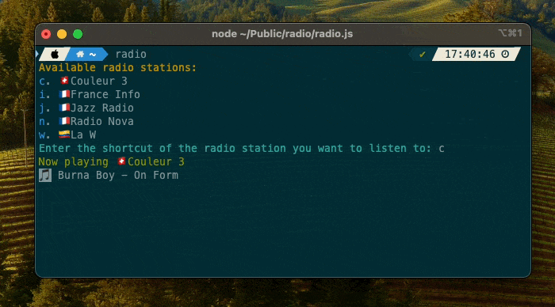

# Radio
A small player when I want to listen radio.

## Demo


## Installation
```bash
brew install ffmpeg node
npm install
```

## Usage
```bash
node radio.js
```

### Add an alias
```bash
echo 'alias radio="node ~/Public/radio/radio.js"' >> ~/.zshrc
```
